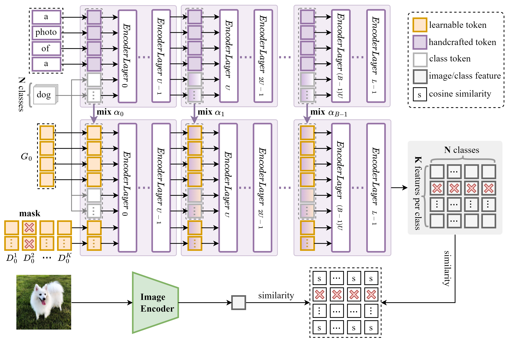

# TriMPL: Masked Multi-Prompt Learning with Knowledge Mixing for Vision-Language Few-shot Learning  [ICMR 2024]

## Main Contributions
We design two mechanisms, *knowledge mixing* and *prompt masking*, for boosting the generalization of prompts at the granularity of each individual prompt and the entire prompt set, respectively. This approach offers a novel insight that ensures the generalizability of prompts from different perspectives and levels.


## Citation
If you use our work, please consider citing:
```bibtex
@inproceedings{trimpl,
    title={TriMPL: Masked Multi-Prompt Learning with Knowledge Mixing for Vision-Language Few-shot Learning},
    author={Xiangyu Liu, Yanlei Shang, Yong Chen},
    booktitle={Proceedings of the 2024 International Conference on Multimedia Retrieval},
    year={2024}
}
```


## Acknowledgements
Our code is based on [Co-CoOp and CoOp](https://github.com/KaiyangZhou/CoOp) and [ProDA](https://github.com/bbbdylan/proda) repository. We thank the authors for releasing their code. If you rely on this work, please consider citing these works as well.
